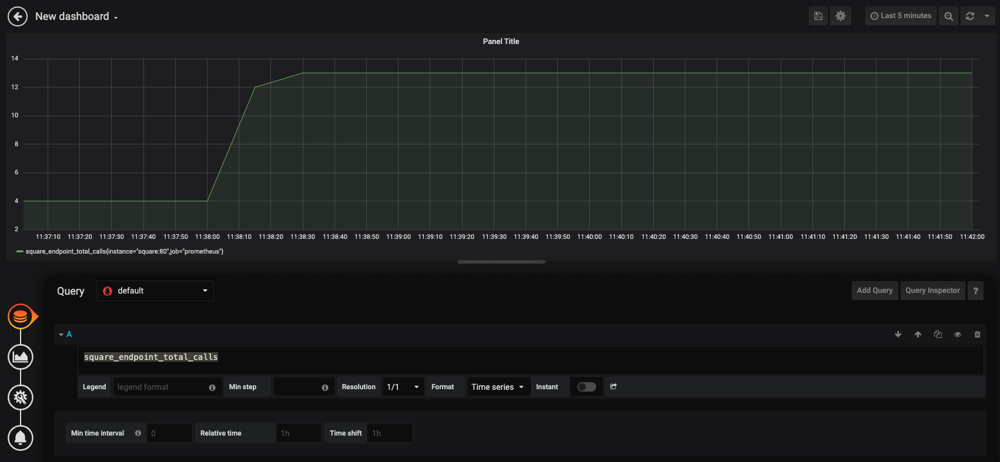

# Developing, Testing, and Operating Cloud-Native Apps

## Prerequisites

- Kubernetes cluster
- [Helm](https://helm.sh)
- [Draft](https://draft.sh)

> Make sure you run `draft init` after installation to initialize the Draft packs.

## Local Development and Debugging

In this exercise you will use Draft to develop a simple Go service.

1. Create an empty folder called `hello`
1. Create a file called `main.go` with these contents:

```
package main
import (
	"fmt"
	"net/http"
)

func helloHandler(w http.ResponseWriter, r *http.Request) {
	fmt.Fprintln(w, "Hello!")
}

func main() {
	http.HandleFunc("/hello", helloHandler)
	http.ListenAndServe(":8080", nil)
}
```

1. Use `draft create` to install scaffolding (e.g. Helm cahrt, Dockerfile):

```
$ draft create
--> Draft detected Go (100.000000%)
--> Ready to sail
```

> Notice the `Dockerfile` and the `charts` folder (in addition to other draft configuration files) was created as part of the create command.

1. To deploy the application, you can use the `up` command:

```
$ draft --debug up
WARNING: no registry has been set, therefore Draft will not push to a container registry. This can be fixed by running `draft config set registry docker.io/myusername`
Hint: this warning can be disabled by running `draft config set disable-push-warning 1`
Draft Up Started: 'hello': 01DR7QJAG61HXP4DAPTDJZWWKD
hello: Building Docker Image: SUCCESS ⚓  (4.0009s)
hello: Releasing Application: SUCCESS ⚓  (2.4642s)
Inspect the logs with `draft logs 01DR7QJAG61HXP4DAPTDJZWWKD`
[debug] No post deploy tasks to run
```

> Note: you will get a warning about Draft not pushing to the container registry. You can ignore this warning for now.

Let's check the pod and the service that got deployed as part of the `up` command:

```
$ kubectl get pods
NAME                           READY   STATUS    RESTARTS   AGE
hello-hello-6b5bdf6957-nw2r5   1/1     Running   0          106s

$ kubectl get services
NAME          TYPE        CLUSTER-IP     EXTERNAL-IP   PORT(S)   AGE
hello-hello   ClusterIP   10.97.19.211   <none>        80/TCP    2m3s
kubernetes    ClusterIP   10.96.0.1      <none>        443/TCP   25h
```

This single command has alreayd simplified the deployment of code to the cluster. We could have done this manually, but it would involve creating the Helm chart and configuring it as well as running the Helm install command.

To test the service, you can use the `connect` command that will create a connection between your machine and the application running inside the cluster:

```
$ draft connect
Connect to hello:8080 on localhost:56631
```

To try the service out, you can run `curl localhost:56631/hello`:

```
$ curl localhost:56631/hello
Hello!
```

Let's make some changes to the code and see what the workflow is for updating the application.

1. Add a `/goodbye` handler to the code:

```
...
func goodbyHandler(w http.ResponseWriter, r *http.Request) {
	fmt.Fprintln(w, "Goodbye!")
}

func main() {
	http.HandleFunc("/hello", helloHandler)
	http.HandleFunc("/goodbye", goodbyeHandler)
...
```

1. Run `draft up` again to update the application first

```
$ draft up
WARNING: no registry has been set, therefore Draft will not push to a container registry. This can be fixed by running `draft config set registry docker.io/myusername`
Hint: this warning can be disabled by running `draft config set disable-push-warning 1`
Draft Up Started: 'hello': 01DR7QZF6CR06DMW6JNDZDQ5HY
hello: Building Docker Image: SUCCESS ⚓  (4.0011s)
hello: Releasing Application: SUCCESS ⚓  (2.2047s)
Inspect the logs with `draft logs 01DR7QZF6CR06DMW6JNDZDQ5HY`
```

1. Connect to the application:

```
$ draft connect
Connect to hello:8080 on localhost:56679
```

1. Make a request:

```
$ curl localhost:56679/goodbye
Goodbye!
```

To remove the application from the cluster you can run `draft delete` from the application folder.

## Monitoring

In this exercise you will deploy Elastic search, Grafana, Kibana, and Fluentd inside your Kubenernetes cluster and see how you can collect metrics from services.

You will be use a Go service that runs an HTTP server and returns a square of the provided number. For example:

```
$ curl localhost:8080/square/55
3025
```

The square service has two endpoints implemented:

```
/square/:number
/metrics
```

The `/metrics` endpoint is the where all the Prometheus metrics for the square service are exposed. This is the endpoint Prometheus scrapes for data. We have also implemented a single custom counter called `totalCalls` (in `handlers.go`) - this counter gets incremented (`totalCalls.Inc()`) each time `/square` endpoint gets called.

Let's run the service and look at the output from the `/metrics` endpoint:

1. From the `/square` folder, build the Docker image (alternatively, you can pull `learncloudnative/square:0.1.0` image)

```
docker build -t square .
```

> Look at the `Dockerfile` to see how we are using a multi-stage build to create the Docker image. Instead of using the `golang:1.12.4-alpine` image to distribute our app with, we are creating a second Docker image from "scratch" using the `scratch` image name (this is a minimal image that tells Docker that the next command in the `Dockerfile` is the first layer in the image). The built image size using the multi-stage build is only 8.98MB (compared to 350MB for the `golang:1.12.4-alpine` image).

1. Run the Docker image, exposing the port 8080:

```
$ docker run -p 8080:8080 learncloudnative/square:0.1.0
{"level":"info","msg":"Running on 8080","time":"2019-08-28T17:57:59Z"}
```

1. From a separate terminal window, send the following request:

```
$ curl localhost:8080/square/123
15129
```

Let's call the `/metrics` endpoint next (the output is truncated):

```
$ curl localhost:8080/metrics
....
TYPE process_virtual_memory_bytes gauge
process_virtual_memory_bytes 1.130496e+08
# HELP process_virtual_memory_max_bytes Maximum amount of virtual memory available in bytes.
# TYPE process_virtual_memory_max_bytes gauge
process_virtual_memory_max_bytes -1
# HELP promhttp_metric_handler_requests_in_flight Current number of scrapes being served.
# TYPE promhttp_metric_handler_requests_in_flight gauge
promhttp_metric_handler_requests_in_flight 1
# HELP promhttp_metric_handler_requests_total Total number of scrapes by HTTP status code.
# TYPE promhttp_metric_handler_requests_total counter
promhttp_metric_handler_requests_total{code="200"} 0
promhttp_metric_handler_requests_total{code="500"} 0
promhttp_metric_handler_requests_total{code="503"} 0
# HELP square_endpoint_total_calls The total number of times square endpoint was called
# TYPE square_endpoint_total_calls counter
square_endpoint_total_calls 1
```

Notice that last metric called `square_endpoint_total_calls` - this is the custom counter we added.

### Deploy the service to Kubernetes

As a next step we are going to deploy this application to the Kubernetes cluster. If you want to use your own Docker image, make sure you have pushed the image to the Docker registry and updated the image name in the `/deploy/square.yaml` file.

> Note: since we are using the LoadBalancer serviec type, make sure you delete any previous service you havve deployed.

1. Deploy the application using `kubectl`:

```
kubectl apply -f deploy/square.yaml
```

1. Ensure Service and Pod are running:

```
$ kubectl get all -l=app=square
NAME                          READY   STATUS    RESTARTS   AGE
pod/square-5c6494469c-nz5wl   1/1     Running   0          103s

NAME             TYPE           CLUSTER-IP      EXTERNAL-IP   PORT(S)        AGE
service/square   LoadBalancer   10.108.111.65   localhost     80:31251/TCP   103s

NAME                     READY   UP-TO-DATE   AVAILABLE   AGE
deployment.apps/square   1/1     1            1           103s

NAME                                DESIRED   CURRENT   READY   AGE
replicaset.apps/square-5c6494469c   1         1         1       103s
```

> Use `-l` parameter to the `kubectl` command, you can filter the resources by their labels.

1. Invoke the service:

```
$ curl localhost/square/12
144
```

### Deploy Prometheus and Grafana

With the application running inside Kubernetes, we can deploy the Prometheus and Grafana next.

#### Prometheus

[Prometheus](https://prometheus.io) is a monitoring and alerting toolkit we will use to gather metrics from our application.

In addition to the Kubernetes Deployment and Service, we will also deploy a ConfigMap that stores the configuration for Prometheus and it looks like this:

```
...
    global:
      scrape_interval: 5s
    scrape_configs:
      - job_name: prometheus
        static_configs:
        - targets: ['square']
...
```

In this configuration we are saying that we want to scrape the `/metrics` endpoint every 5 seconds and the target service name is `square` (this is Kubernetes service name of the square application).

Let's deploy the `prometheus.yaml`:

```
kubectl apply -f deploy/prometheus.yaml
```

Use `kubectl get pods` to ensure Prometheus is up and running.

#### Grafana

[Grafana](https://grafana.com) is an analytics and monitoring tool that can use Prometheus as the database.

You are going to use Helm to deploy Grafana to your Kubernetes cluster:

```
helm install --name grafana stable/grafana --set rbac.create=true
```

The notes after the installation has completed will show you how to obtain the password and the connect to the Grafana instance running inside the cluster.

1.  To get the password, run:

    ```
    kubectl get secret --namespace default grafana -o jsonpath="{.data.admin-password}" | base64 -D
    ```

1.  To connect to the Grafana pod:

    ```
    export POD_NAME=$(kubectl get pods --namespace default -l "app=grafana,release=grafana" -o jsonpath="{.items[0].metadata.name}")

    kubectl --namespace default port-forward $POD_NAME 3000
    ```

1.  Open `http://localhost:3000` and login with `admin` and the password from the first step to login
1.  Click **Add datasource** button
1.  Select the Prometheus data source
1.  Enter `http://prometheus:9090` in the URL field

    > Note: `prometheus` in the URL above is the Kubernetes service name and a way to access the Prometheus.

1.  Click **Save & Test** button
1.  Go back to the Grafana home page and click **New Dashboard** button to add a new dashboard
1.  Click the **Add Query** option
1.  In the query field, type:

    ```
    square_endpoint_total_calls
    ```

As you click away from the field, the graph should be updated and look like this:



Another sample query we could add is the memory utilization of the service:

```
go_memstats_heap_inuse_bytes{instance="square:80"} / 1000000
```

As an exercise try adding an additiona counter that only increments when the provided numbers are greated than 100.

### Deploy the EFK stack

Let's deploy the EFK stack - EKF stands for Elasticsearch, Fluentd and Kibana. EFK is one of the popular centralized logging solutions.

Elasticsearch is a scalable search engine that allows full-text search and analytics. It's used for indexing and searching through large volumes of log data. It's commonly used along wth Kibana, which is a data visualization and dashboard for Elasticsearch.

Fluentd is used to collect and move all log data to the Elasticsearch backend. The way we set up Fluentd is to collect logs from containers.

To deploy the whole stack, run the following commands:

```
kubectl apply -f deploy/elastic.yaml
kubectl apply -f deploy/kibana.yaml
kubectl apply -f deploy/fluentd.yaml
```

The pods might take a little while to start up. In case the pods are not starting up, make sure you have allocated enough memory to your Kubernetes cluster (e.g. at least 6GB or more to be safe).

To open Kibana, we need to get the pod name and then use `port-forward`:

```
export KIBANA_POD=$(kubectl get pods --namespace kube-system -l "app=kibana" -o jsonpath="{.items[0].metadata.name}")

kubectl --namespace kube-system port-forward $KIBANA_POD 5601:5601 & open http://localhost:5601
```

When the browser opens, click the **Discover** button and create an index pattern:

1. Type `logstash*` in the Index pattern field and click the **Next step** button
1. From the dropdown, select the `@timestamp` value
1. Click **Create index pattern**

With the index set up you can click the Discover link again and use the search field to search through the logs. As an example, you can type in `square` to get all entries that contain the word `square`.

From the list of fields on the left, you can also group the log entries. Try clicking the Add button on the `kubernetes.pod_name` field.

As an exercise, try adding an additional log entry to the `square` service and create a query in Kibana that allows you to filter for it.

For example, you could add the following line to the `squareHandler` that outputs the result that is being returned:

```
logrus.Infof("Returning result: %d", num*num)
```

You will have to rebuild the service and restart the pod in Kubernetes. Note: you can change the `imagePullPolicy:` in the deployment YAML to `Never` - this way you don't need to push the image to the Docker hub, instead Docker for Mac/Minikube will use the image you built locally.
